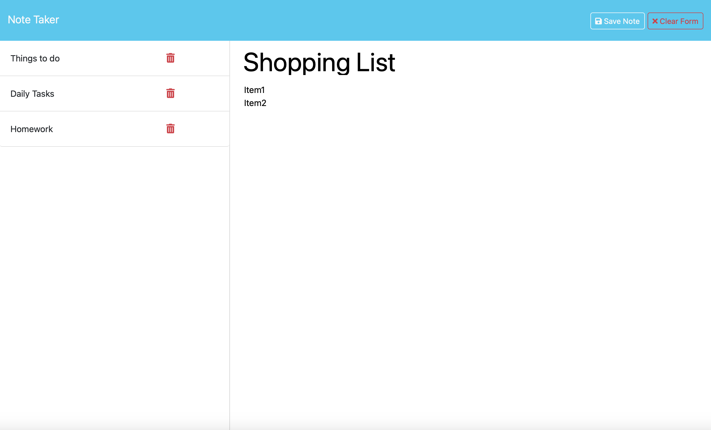

# Note Taker

The Note-Taker Application is a lightweight and efficient tool for creating, viewing, and managing notes. Built using Node.js and Express.js, this application offers a clean and intuitive interface for users to store their thoughts and ideas. With persistent storage, your notes are saved even when the server restarts, providing a reliable solution for note-taking.



## Table of Contents

- [Overview](#overview)
- [Features](#features)
- [Technologies Used](#technologies-used)
- [Concepts Covered](#concepts-covered)
- [Learning Objectives](#learning-objectives)
- [How to Run](#how-to-run)
- [Future Improvements](#future-improvements)
- [Summary](#summary)

## Overview

The Note-Taker Application is designed to help users easily create, view, and manage their notes. Users can add new notes with a title and body, view a list of saved notes, and delete notes they no longer need. The application ensures data persistence by storing notes in a JSON file, making them available across sessions.

## Features

- **Add New Notes**: Users can create notes by entering a title and content. Each note is automatically assigned a unique identifier for easy management.
- **View Saved Notes**: A list of all saved notes is displayed, allowing users to view and select any note.
- **Delete Notes**: Users can delete specific notes from the list, helping keep their workspace tidy.
- **Persistent Storage**: Notes are saved in a JSON file, ensuring data remains intact even after restarting the server.
- **Responsive Interface**: The application provides a user-friendly design that makes note management simple and intuitive.

## Technologies Used

- **Node.js**: Powers the server-side functionality.
- **Express.js**: Handles server routing and middleware for request processing.
- **UUID**: Generates unique IDs for notes to maintain organized storage.
- **File System (fs)**: Reads and writes data to a JSON file for persistent storage.
- **HTML/CSS/JavaScript**: Provides the frontend interface for user interaction.

## Concepts Covered

- **RESTful API Development**: Building CRUD operations (Create, Read, Delete) to manage notes effectively.
- **Data Persistence**: Using the `fs` module to save and retrieve data from a JSON file.
- **Dynamic Routing**: Creating routes to handle different operations such as fetching, adding, and deleting notes.
- **Middleware Usage**: Utilizing middleware for serving static files and parsing JSON data.

## Learning Objectives

1. Learn to set up and configure an Express.js server for handling API requests.
2. Practice implementing RESTful API routes to perform CRUD operations.
3. Understand the use of the `fs` module to manage persistent storage.
4. Explore the UUID library for generating unique identifiers for each note.
5. Develop skills in connecting the frontend and backend for seamless user interaction.

## How to Run

1. **Clone the Repository**  
   Clone the project repository to your local machine using the following command:

   ```bash
   git clone https://github.com/BrockAltug/note-taker.git
   ```

   ```bash
   cd note-taker
   ```

2. **Install Dependencies**  
   Install the required dependencies by running:

   ```bash
   npm install
   ```

3. **Start the Application**  
   Launch the application by running:

   ```bash
   node server.js
   ```

4. **Access the Application**  
   Open your browser and navigate to:
   ```
   http://localhost:3001
   ```
   From here, you can start creating, viewing, and managing notes.

## Future Improvements

- **Edit Notes**: Add functionality for editing the content of saved notes.
- **Search Feature**: Implement a search bar to filter notes by title or content.
- **Database Integration**: Replace the JSON file with a database such as MongoDB or PostgreSQL for enhanced scalability.
- **User Accounts**: Enable user authentication to support individual note collections.
- **Customizable Themes**: Introduce light and dark mode options for better usability.

## Summary

The Note-Taker Application is a straightforward yet powerful tool for managing notes. It combines dynamic routing, persistent storage, and a responsive interface to provide a seamless user experience. Whether you're looking to jot down quick ideas or keep track of important information, this application ensures your notes are always organized and accessible. Perfect for anyone seeking a simple and effective way to stay productive!
